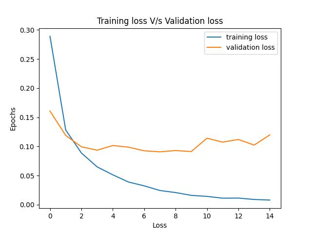
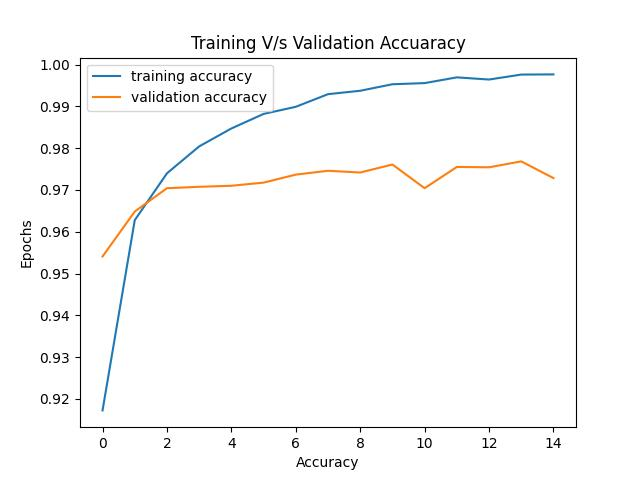

#  Handwritten Digit Classification using TensorFlow

This project demonstrates how to build a simple **Feedforward Neural Network (FNN)** using TensorFlow and Keras to classify handwritten digits from the MNIST dataset.

---

## 📌 Project Overview

- **Dataset:** MNIST (70,000 grayscale images of digits 0–9)
- **Model:** Feedforward Neural Network (2-layer fully connected)
- **Accuracy:** ~97.5%
- **Tools:** TensorFlow, Keras, Matplotlib, NumPy, scikit-learn

---

## 📊 Results

### 📉 Training vs Validation Loss



---

### 📈 Training vs Validation Accuracy



---

##  Example Prediction

The model predicts handwritten digits. Example:

```python
model.predict(Xtest[0].reshape(1, 28, 28)).argmax(axis=1)
# Output: array([7])
